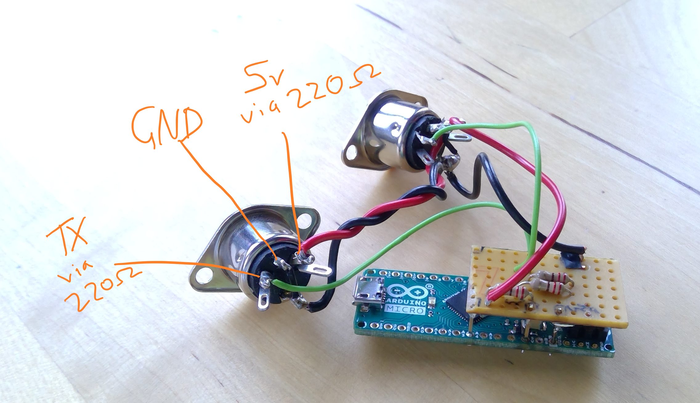

MIDI Interface for Volcas and friends
=====================================

Designed for an arduino leonardo/micro so it can be a USB midi device

Helps with mapping for plugging a Volca Sample and another instrument
* the Sample uses channels 1-10 (one per sample)
* other instruments should use higher channels

In non-volca mode, it's just a fairly straightforward USBMIDI -> MIDI OUT interface

Wiring
------

